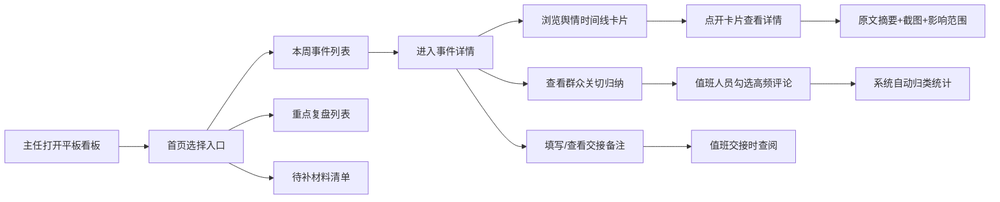

## 1. 产品概述

面向县区融媒体中心主任的平板端舆情复盘看板，用于例会或值班交接时快速、结构化地讲清楚一件本地舆情事件，解决传统舆情汇报信息散乱、重点不清、交接断层的痛点。

- 目标用户：县区融媒体中心主任、值班负责人
- 核心价值：3分钟讲清舆情脉络，5分钟完成值班交接，10分钟掌握群众关切

## 2. 核心功能

### 2.1 用户角色

| 角色 | 使用场景 | 核心权限 |
|------|----------|----------|
| 中心主任 | 例会复盘、决策参考 | 查看全部事件、重点复盘、群众关切归纳 |
| 值班人员 | 日常值守、交接工作 | 录入事件、勾选高频问题、填写交接备注 |

### 2.2 功能模块

1. **首页看板**：本周事件入口、重点复盘入口、待补材料入口
2. **事件详情页**：舆情时间线卡片（微信群爆料→短视频转发→上级媒体报道→官方回复）
3. **群众关切归纳**：评论高频问题勾选、自动分类汇总（住房/交通/教育/执法态度等）
4. **交接备注**：未核实信息、需联系部门、不宜公开内容的结构化记录

### 2.3 页面详情

| 页面名称 | 模块名称 | 功能描述 |
|----------|----------|----------|
| 首页看板 | 三大入口卡片 | 本周事件（数量徽标）、重点复盘（标记状态）、待补材料（提醒数量） |
| 首页看板 | 顶部状态栏 | 当前值班人、日期时间、快速搜索 |
| 事件列表页 | 事件卡片列表 | 按时间倒序排列，展示事件标题、时间、舆情等级、当前阶段 |
| 事件详情页 | 舆情时间线 | 四张顺序卡片：微信群爆料、短视频平台转发、上级媒体报道、官方回复 |
| 事件详情页 | 卡片展开内容 | 原文摘要、截图备注、影响范围（覆盖人数/传播渠道） |
| 事件详情页 | 群众关切归纳 | 高频问题勾选、分类标签、问题数量统计、可视化分布 |
| 事件详情页 | 交接备注区 | 三类分区输入：未核实信息、需联系部门、不宜公开内容 |
| 重点复盘页 | 复盘事件列表 | 标注复盘完成状态、复盘结论摘要、责任人 |
| 待补材料页 | 材料清单 | 缺项类型、责任部门、截止时间、补全状态 |

## 3. 核心流程

## 4. 用户界面设计

### 4.1 设计风格

- 主色：政务深蓝 `#1e3a5f`，体现专业稳重
- 辅色：警示橙 `#e67e22`（高风险舆情）、信息绿 `#27ae60`（已处置）
- 中性色：石板灰系列，保证信息可读性
- 卡片风格：圆角 12px，浅阴影，悬停微上浮
- 字体：思源黑体（Source Han Sans CN），标题加粗、正文常规
- 图标：Lucide 线性图标，保持简约统一
- 整体风格：政务专业风 + 现代卡片式布局，适合平板横屏操作

### 4.2 页面设计概述

| 页面名称 | 模块名称 | UI 要素 |
|----------|----------|---------|
| 首页看板 | 三大入口 | 大卡片、图标+标题+数据徽标、渐变背景、点击涟漪动效 |
| 事件列表页 | 事件卡片 | 左侧舆情等级色条、事件标题、时间标签、阶段进度条 |
| 事件详情页 | 时间线 | 垂直时间轴、序号圆点、卡片横向排列连接线、渐入动画 |
| 事件详情页 | 群众关切 | 分类进度条、勾选框、标签云、环形分布图 |
| 事件详情页 | 交接备注 | 三色分区背景（黄/蓝/灰）、结构化输入框、提交人署名 |

### 4.3 响应式

- 设计基准：平板横屏（1024px 以上）
- 触控优化：按钮最小 44×44px，卡片间距充足，避免误触
- 次要适配：竖屏时卡片自动换行堆叠
