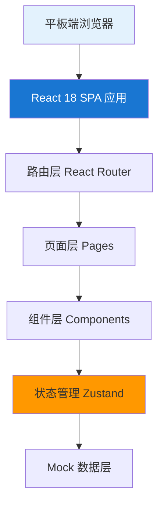
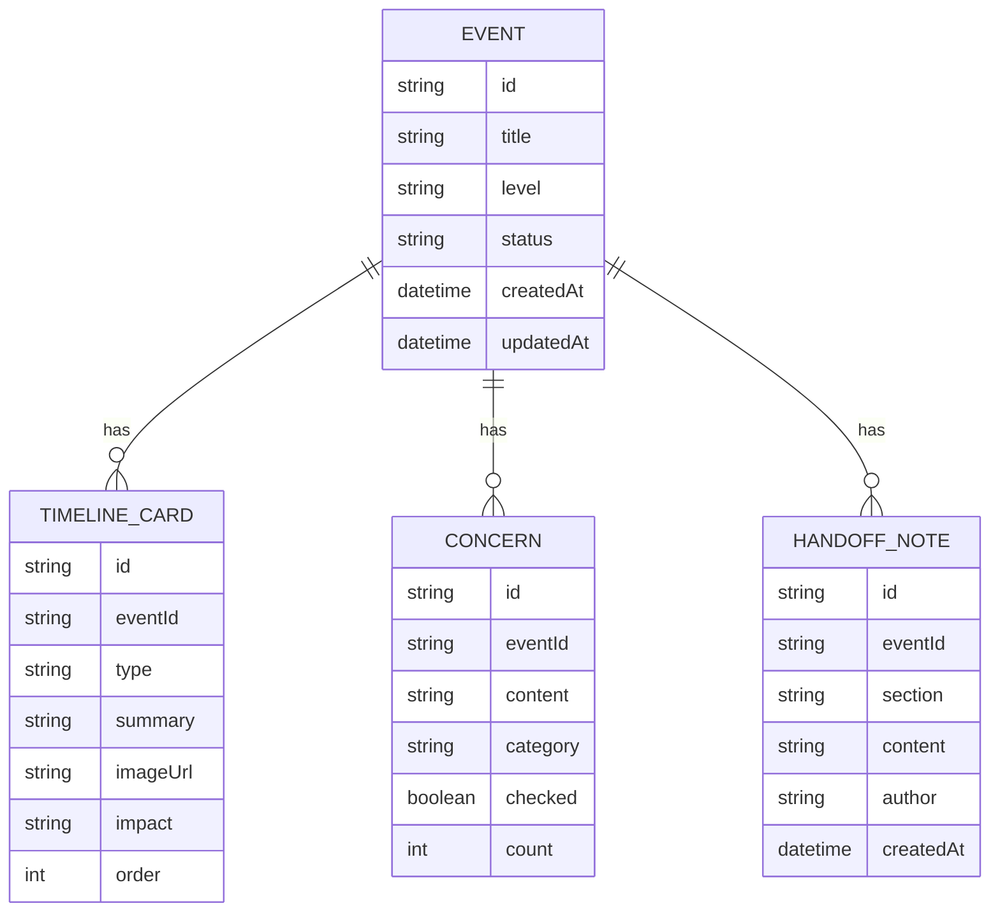

## 1. 架构设计



## 2. 技术描述

- 前端：React 18 + TypeScript + Vite + TailwindCSS 3
- 状态管理：Zustand
- 路由：React Router DOM v6
- 图标：Lucide React
- 后端：无后端，采用 Mock 数据 + localStorage 持久化
- 数据库：浏览器 localStorage 存储用户操作数据

## 3. 路由定义

| 路由 | 用途 |
|------|------|
| / | 首页看板（三大入口） |
| /events | 本周事件列表 |
| /events/:id | 事件详情页 |
| /reviews | 重点复盘列表 |
| /materials | 待补材料清单 |

## 4. 数据模型

### 4.1 数据模型定义



### 4.2 核心类型定义

```typescript
type EventLevel = 'low' | 'medium' | 'high' | 'critical';
type EventStatus = 'monitoring' | 'responding' | 'resolved' | 'reviewed';
type TimelineType = 'wechat' | 'shortvideo' | 'media' | 'official';
type ConcernCategory = 'housing' | 'transport' | 'education' | 'law_enforcement' | 'environment' | 'healthcare' | 'other';
type HandoffSection = 'unverified' | 'to_contact' | 'confidential';

interface EventItem {
  id: string;
  title: string;
  level: EventLevel;
  status: EventStatus;
  createdAt: string;
  updatedAt: string;
  description: string;
}

interface TimelineCard {
  id: string;
  eventId: string;
  type: TimelineType;
  title: string;
  summary: string;
  imageNote: string;
  impact: string;
  reachCount: number;
  order: number;
}

interface ConcernItem {
  id: string;
  eventId: string;
  content: string;
  category: ConcernCategory;
  checked: boolean;
  count: number;
}

interface HandoffNote {
  id: string;
  eventId: string;
  section: HandoffSection;
  content: string;
  author: string;
  createdAt: string;
}
```
